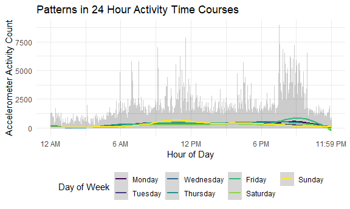
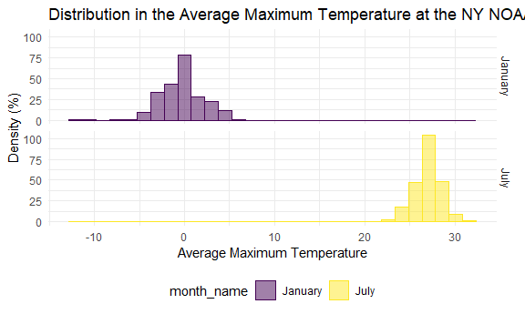
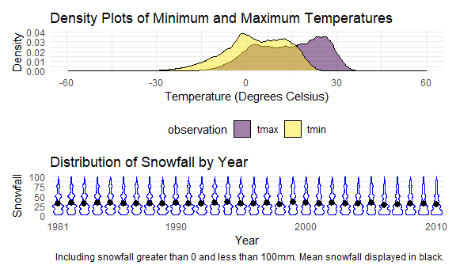

P8105 Homework 3
================
sarah\_8105

This is my third homework assignment for P8105.

``` r
library(tidyverse)
```

    ## -- Attaching packages ----------------------------------- tidyverse 1.3.0 --

    ## v ggplot2 3.3.2     v purrr   0.3.4
    ## v tibble  3.0.3     v dplyr   1.0.2
    ## v tidyr   1.1.2     v stringr 1.4.0
    ## v readr   1.3.1     v forcats 0.5.0

    ## -- Conflicts -------------------------------------- tidyverse_conflicts() --
    ## x dplyr::filter() masks stats::filter()
    ## x dplyr::lag()    masks stats::lag()

``` r
library(p8105.datasets)
library(ggridges)

knitr::opts_chunk$set(
  fig.width = 6,
  fig.asp = .6,
  out.width = "90%"
)

theme_set(theme_minimal() + theme(legend.position = "bottom"))

options(
  ggplot2.continuous.colour = "viridis",
  ggplot2.continuous.fill = "viridis"
)

scale_colour_discrete = scale_colour_viridis_d
scale_fill_discrete = scale_fill_viridis_d
```

## Problem 1

In this first problem, I explore the Instacart data. I create a plot of
the number of items ordered in each aisle, limiting to aisles with more
than 10,000 items ordered.

``` r
data("instacart")
```

Next, I create a table that displays the three most popular items in
each of the aisles of “baking ingredients”, “dog food care”, and
“packaged vegetables fruits”. The table displays the number of times
each item was ordered.

``` r
instacart %>%
  filter(aisle %in% c("baking ingredients", "dog food care", "packaged vegetables fruits")) %>%
  group_by(aisle, product_name) %>%
  summarize(orders = n()) %>%
  arrange(aisle, desc(orders)) %>%
  top_n(n = 3) %>%
  knitr::kable()
```

    ## `summarise()` regrouping output by 'aisle' (override with `.groups` argument)

    ## Selecting by orders

| aisle                      | product\_name                                 | orders |
| :------------------------- | :-------------------------------------------- | -----: |
| baking ingredients         | Light Brown Sugar                             |    499 |
| baking ingredients         | Pure Baking Soda                              |    387 |
| baking ingredients         | Cane Sugar                                    |    336 |
| dog food care              | Snack Sticks Chicken & Rice Recipe Dog Treats |     30 |
| dog food care              | Organix Chicken & Brown Rice Recipe           |     28 |
| dog food care              | Small Dog Biscuits                            |     26 |
| packaged vegetables fruits | Organic Baby Spinach                          |   9784 |
| packaged vegetables fruits | Organic Raspberries                           |   5546 |
| packaged vegetables fruits | Organic Blueberries                           |   4966 |

In the final portion of problem 1, I create a table that shows the mean
hour of the day at which Pink Lady apples and coffee ice cream are
ordered on each day of the week.

``` r
instacart %>%
  filter(product_name %in% c("Pink Lady Apples", "Coffee Ice Cream")) %>%
  group_by(product_name, order_dow) %>%
  summarize(mean_hour = mean(order_hour_of_day)) %>%
  arrange(product_name, order_dow) %>%
  pivot_wider(
    names_from = product_name,
    values_from = mean_hour
    ) %>%
  knitr::kable(digits = 1)
```

    ## `summarise()` regrouping output by 'product_name' (override with `.groups` argument)

| order\_dow | Coffee Ice Cream | Pink Lady Apples |
| ---------: | ---------------: | ---------------: |
|          0 |             13.8 |             13.4 |
|          1 |             14.3 |             11.4 |
|          2 |             15.4 |             11.7 |
|          3 |             15.3 |             14.2 |
|          4 |             15.2 |             11.6 |
|          5 |             12.3 |             12.8 |
|          6 |             13.8 |             11.9 |

The Instacart data contain de-identified grocery orders for users of
this online grocery service, which partners with local stores like Whole
Foods and Fairway to deliver groceries within 2 hours of order. Each row
in the data set represents a product that has been ordered. The data
include variables about the order (such as date and time), the customer,
and about the products ordered (such as product name and
department/aisle where the product can be found).

The resulting data set contains 1384617 rows and 15 columns. There are a
total of 131209 orders, 131209 customers, and 39123 products represented
in these data. On average, customers have placed 1 orders and each order
contains 11 products.

There are 134 aisles represented in the data. Most items that are
ordered come from the fresh vegetables aisle, with 150609 items ordered.
The most popular item from the baking ingredients aisle was Light Brown
Sugar, the most population item from the dog food & care aisle was Snack
Sticks Chicken & Rice Recipe Dog Treats, and the most population item
from the packaged vegetables & fruits aisle was Organic Baby Spinach.
Coffee ice cream tended to be ordered later in the day than pink lady
apples.

## Problem 2

In this code chunk, I load and tidy the accelerometer data. I use the
`clean_names()` function from the `janitor` package to clean the
variable names, create a weekday versus weekend variable, and convert
variable types.

``` r
accel = 
  read_csv(
    "./Data/accel_data.csv") %>%
  janitor::clean_names() %>%
  pivot_longer(
    activity_1:activity_1440,
    names_to = "activity_count",
    values_to = "active",
    names_prefix = "activity_"
  ) %>%
  mutate(weekend = as.factor(ifelse(day %in% c("Saturday", "Sunday"), "Weekend", "Weekday")),
         day = as.factor(day),
         day = forcats::fct_relevel(day, c("Monday", "Tuesday", "Wednesday", "Thursday", "Friday", "Saturday", "Sunday")),
         activity_count = as.numeric(activity_count))
```

    ## Parsed with column specification:
    ## cols(
    ##   .default = col_double(),
    ##   day = col_character()
    ## )

    ## See spec(...) for full column specifications.

These data represent five weeks of accelerometer data collected on a 63
year-old Advanced Cardiac Care Center of Columbia University Medical
Center patient who has been diagnosed with the chronic conditions of
congestive heart failure and obesity. The resulting data set contains
50400 rows and 6 variables. This data set contains indicator variables
for the week number (`week`) and day of the week (`day`), a variable
(`activity_count`) that represents incremental one-minute measurement
intervals of the accelerometer, a variable that represents the
accelerometer reading (`active`) and the `weekend` indicator that
defines whether it was a weekend or weekday.

In the next code chunk, I aggregate the activity totals for each day and
display the data in a table.

``` r
accel %>%
  group_by(week, day) %>%
  summarize(
    total_active = sum(active, na.rm = TRUE)) %>% 
  pivot_wider(
    names_from = week,
    values_from = total_active,
    names_prefix = "Week "
  ) %>%
  knitr::kable(digits = 1)
```

    ## `summarise()` regrouping output by 'week' (override with `.groups` argument)

| day       |   Week 1 | Week 2 | Week 3 | Week 4 | Week 5 |
| :-------- | -------: | -----: | -----: | -----: | -----: |
| Monday    |  78828.1 | 295431 | 685910 | 409450 | 389080 |
| Tuesday   | 307094.2 | 423245 | 381507 | 319568 | 367824 |
| Wednesday | 340115.0 | 440962 | 468869 | 434460 | 445366 |
| Thursday  | 355923.6 | 474048 | 371230 | 340291 | 549658 |
| Friday    | 480542.6 | 568839 | 467420 | 154049 | 620860 |
| Saturday  | 376254.0 | 607175 | 382928 |   1440 |   1440 |
| Sunday    | 631105.0 | 422018 | 467052 | 260617 | 138421 |

From this table, there appears as though the patient was not active or
was not using the accelerometer on Saturdays in weeks 4 and 5. On these
days, the patient had an activity count of 1,440, which is likely a
default activity count of 1 at each one-minute measurement interval. The
patient also had lower activity levels on Sunday of weeks 4 and 5 than
in the first 3 weeks of observation.

In the next code chunk, I create a single-panel plot that displays the
24-hour activity trends for each day, color-coded by day of the week.
I’ve displayed these data using `geo_hex()` to limit the amount of
data presented.

``` r
accel %>%
  group_by(day_id) %>%
  ggplot(aes(x = activity_count, y = active, fill = day)) + 
  geom_hex(alpha = .5) +
  scale_x_continuous(
    breaks = c(0, 360, 720, 1080, 1440),
    labels = c("12 AM", "6 AM", "12 PM", "6 PM", "11:59 PM"),
  ) +
  labs(
    title = "Patterns in 24 Hour Activity Time Courses",
    x = "Hour of Day",
    y = "Accelerometer Activity Count",
    fill = "Day of Week"
  )
```



Based on this graph, this patient begins increasing their activity level
around 6 AM. In general, this patient’s activity level remains
relatively steady throughout the day, with some noticeable exceptions.
For example, on Sundays there is an increase in activity around 12 PM.
During weekdays and Saturdays, there is an increase in activity around
8-9 PM.

## Problem 3

In this final problem, I explore and clean the NY NOAA data. First, I
separate year, month, and day. I then change the units for temperature
from tenths of degrees C to degrees C and precipitation from tenths of
mm to mm.

``` r
data("ny_noaa")

month_df =
  tibble(
    month = 1:12,
    month_name = month.name,
    month_abbr = month.abb
  )

noaa = ny_noaa %>%
  separate(date, into = c("year", "month", "day"), sep = "-") %>%
  mutate(month = as.integer(month),
         day = as.integer(day),
         year = as.integer(year),
         prcp = prcp / 10,
         tmax = as.integer(tmax) / 10,
         tmin = as.integer(tmin) / 10,
         ) %>%
  left_join(month_df, by = "month")
```

The National Oceanic and Atmospheric Association (NOAA) National
Climatic Data Center data contain summary statistics from weather
stations across the country. This subset of the NOAA data contain daily
summary statistics on precipitation amount (`prcp`), snowfall amount
(`snow`), snow depth (`snwd`), and minimum and maximum temperature
(`tmax` and `tmin`) from the New York state weather stations from
1981-2010.

The resulting data set contains 2595176 rows and 7 columns. There is
substantial missing data, with 43.7102532% of observations missing
maximum temperature, 43.7126422% of observations missing minimum
temperature, 14.689601% of observations missing snow amount, and
22.8033089% of observations missing snow depth. Since it rarely snows in
New York outside of winter months, the most common observed snowfall
values isnumeric orders,

In the next code chunk, I create a two-panel plot showing the average
max temperature in January and in July in each station across years.

``` r
noaa %>%
  select(id, month_name, year, tmax) %>%
  filter(month_name %in% c("January", "July")) %>%
  group_by(id, month_name, year) %>%
  summarize(mean_tmax = mean(tmax, na.rm = TRUE)) %>%
  drop_na(mean_tmax) %>% 
  ggplot(aes(x = year, y = mean_tmax, color = month_name)) + 
    geom_point(alpha = .2) + 
    geom_smooth(se = FALSE, size = 2) +
    facet_grid(. ~ month_name) +
    scale_x_discrete(
      breaks = c(1980, 1990, 2000, 2010)
      ) +
    labs(
      title = "Average Maximum Temperature at NY NOAA Stations from 1980-2010",
      x = "Year",
      y = "Average Maximum Temperature",
      color = "Month"
    )
```

    ## `summarise()` regrouping output by 'id', 'month_name' (override with `.groups` argument)

    ## `geom_smooth()` using method = 'gam' and formula 'y ~ s(x, bs = "cs")'



In this next code chunk, I create a two-panel plot showing `tmax` and
`tmin` for the full data set and a plot showing the distribution of
snowfall values great than 0 and less than 100 separately by year.

``` r
noaa %>%
  select(id, tmax, tmin) %>%
  pivot_longer(
    tmax:tmin,
    names_to = "observation",
    values_to = "temp"
  ) %>%
  drop_na(temp) %>%
  ggplot(aes(x = temp, fill = observation)) + 
    geom_density(alpha = .5) +
    labs(
      title = "Density Plots of Minimum and Maximum Temperatures",
      x = "Temperature",
      y = "Density",
      color = "Observation"
    )
```



From this graph, we can see that…
